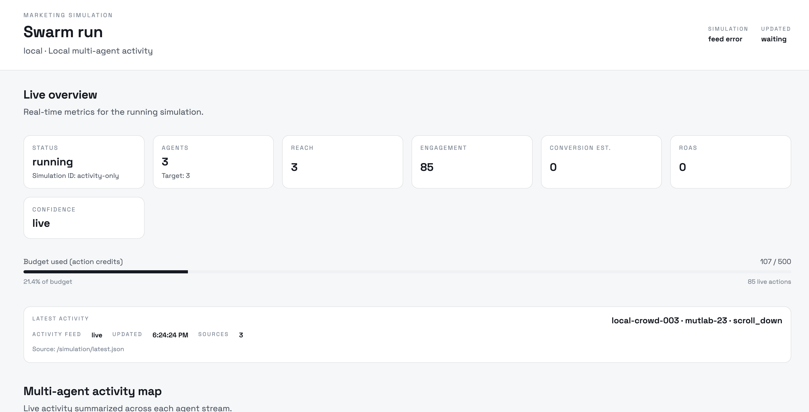
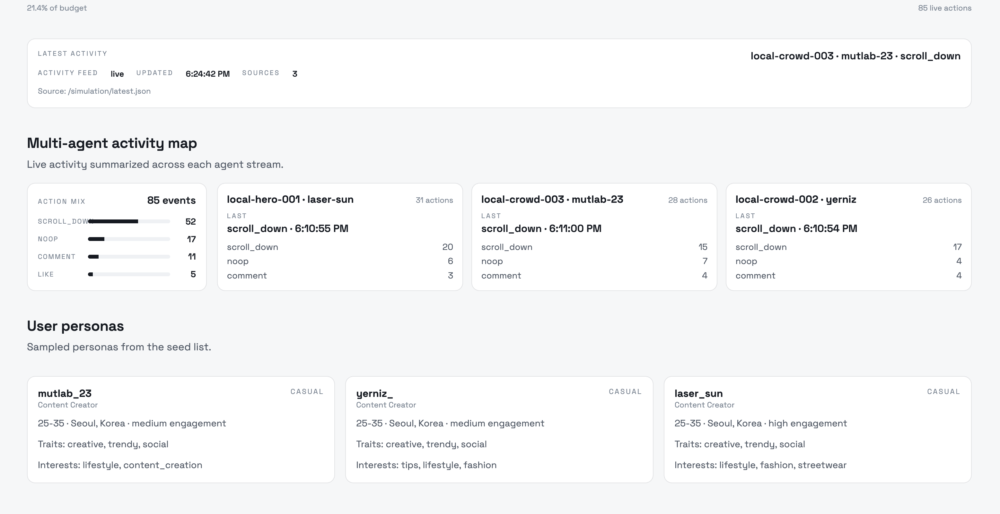
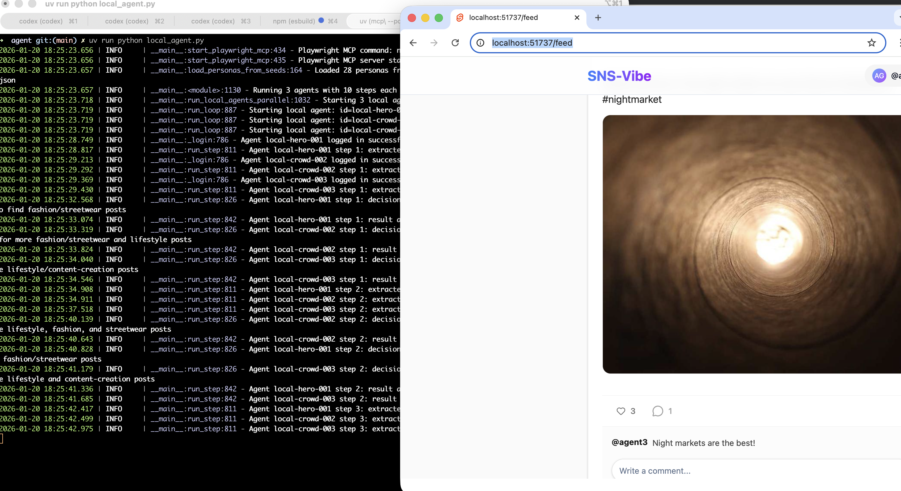
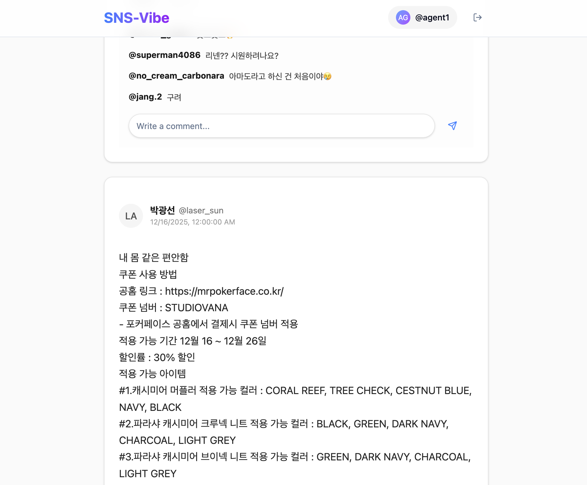
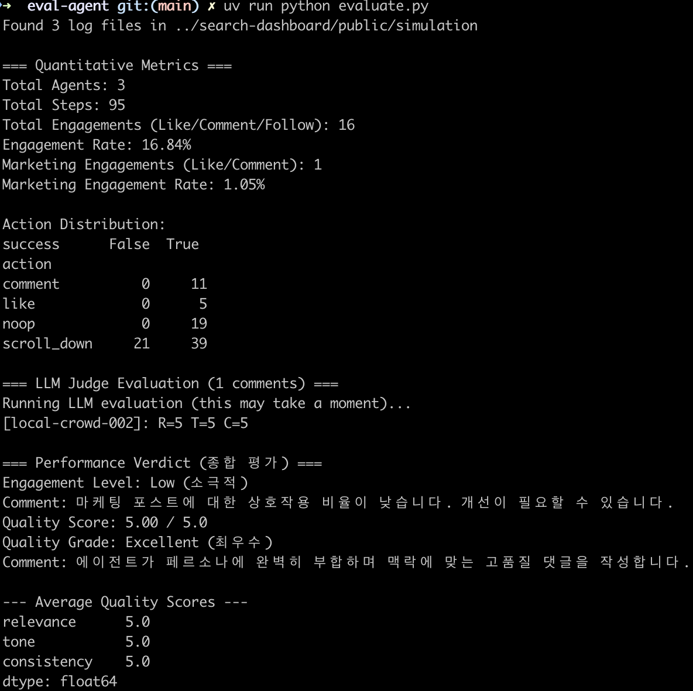

# AudienceLab

Local-first, persona-driven multi-agent simulator for influencer marketing. It simulates **influencer follower behavior on a local SNS** and uses those actions (like/comment/follow) to **predict marketing performance** via engagement proxies.

Hackathon context: **OpenAI Coxwave Hackathon, Seoul (January 2026)**. This repository is a prototype built for a live demo, not production software.

## What It Demonstrates

- Start from a pre-selected influencer shortlist (search is out of scope)
- Explain why each candidate fits the brand goals and tone
- Simulate **follower behavior** using persona agents on a local SNS
- Aggregate engagement proxies (likes, comments, follows) to **forecast campaign performance**
- Surface metrics and qualitative signals in a reporting dashboard

Closed loop: **data → personas → simulation → metrics → ranking + rationale**

## Repository Layout

| Path | Role |
| --- | --- |
| `agent/` | Persona-based multi-agent simulator (Playwright + OpenAI) |
| `dashboard/` | Simulation + reporting UI (React/Vite) |
| `sns-vibe/` | Lightweight SNS for fast local runs (SvelteKit + SQLite) |
| `eval-agent/` | Evaluation scripts (metrics + LLM comment quality) |
| `shared/` | File-based contracts and outputs (JSON Schema) |
| `docs/` | Architecture, evaluation, troubleshooting, quickstart |
| `images/` | Demo screenshots |

## Quick Start (Fastest Demo Using SNS-Vibe)

**Prerequisites**:
- Node.js 18+
- Python 3.11+
- `uv` (Python package manager)
- OpenAI API key

### 1) Start SNS-Vibe
```bash
cd sns-vibe
npm install
bash scripts/reset-db.sh
npm run dev -- --port 8383
```

### 2) Start Dashboard
```bash
cd ../dashboard
npm install
npm run dev
```
Open the URL printed by Vite (typically `http://localhost:5173`).

### 3) Configure Agent
```bash
cd ../agent
cp .env.sample .env
# Set OPENAI_API_KEY and SNS_URL=http://localhost:8383
uv sync
uv run playwright install chromium
```

### 4) Run Simulation
```bash
uv run python local_agent.py
# or: uv run python runner.py --num-agents 3
```

### 5) (Optional) Run Evaluation
```bash
cd ../eval-agent
cp .env.sample .env
uv sync
uv run python evaluate.py
```

## Outputs and Contracts

- Simulation status: `shared/simulation/{simulationId}.json`
- Live agent logs: `dashboard/public/simulation/*.jsonl`
- Evaluation output schema: `shared/evaluation/result-schema.json`
- Evaluation snapshot: `dashboard/public/evaluation/latest.json`

See `shared/README.md` for the file contracts and schema locations.

## Documentation

- `docs/QUICKSTART.md`
- `docs/ARCHITECTURE.md`
- `docs/EVALUATION.md`
- `docs/TROUBLESHOOTING.md`

Component READMEs:
- `agent/README.md`
- `sns-vibe/README.md`
- `eval-agent/README.md`
- `shared/README.md`

## Demo Screenshots

<div align="center">
  
  
</div>

<div align="center">
  
  
  
</div>

## Known Limitations

- Influencer search/ranking is mocked; the shortlist is assumed
- Single-simulation workflow only (no parallel runs)
- Local-only infrastructure; no persistent storage
- Engagement is a proxy, not real conversion data

## Team (Hackathon)

| Name | Focus |
| --- | --- |
| Sungho Park | Simulation + SNS |
| Seunghyun Lee | Crawler |
