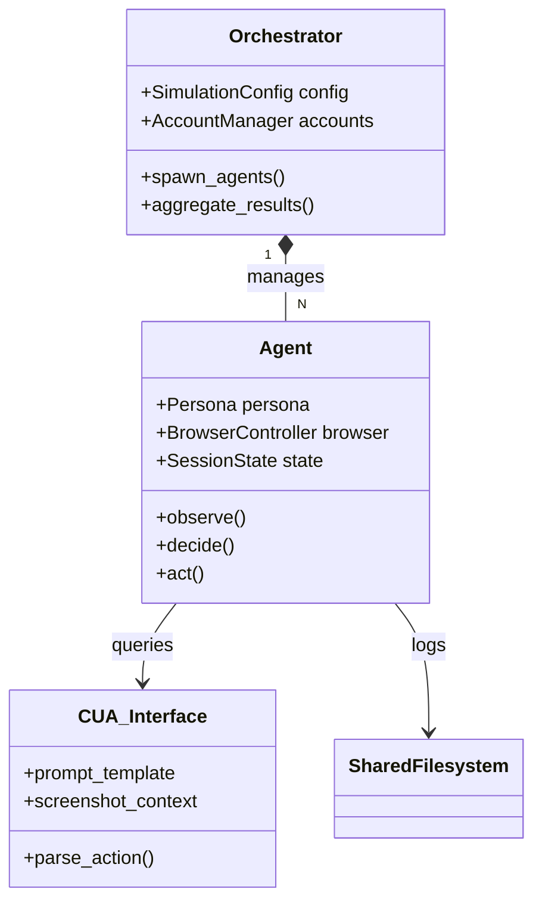
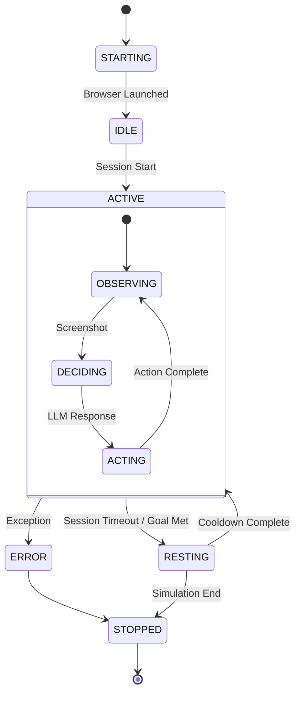

# Agent Simulation Engine Design Specification

본 문서는 **페르소나 기반 자율 브라우저 에이전트 시스템**의 상세 설계 명세서이다. 이 시스템은 정의된 성격(Persona)을 가진 가상의 사용자들이 격리된 SNS 환경에서 인간과 유사한 패턴으로 활동하도록 시뮬레이션하는 것을 목적으로 한다.

## 1. System Architecture

시스템은 **중앙 관리자(Orchestrator)**와 **개별 에이전트(Worker)**로 구성된 계층적 구조를 가진다.



### 1.1 Design Principles
1.  **Isolation (격리성)**: 각 에이전트는 독립된 브라우저 컨텍스트(Incognito Context)와 세션을 가지며, 서로의 메모리나 상태를 공유하지 않는다.
2.  **Stateless Action Loop (비상태 행동 루프)**: 에이전트의 매 행동은 [현재 스크린샷 + 페르소나 정의 + 이전 행동 요약]에 기반한 독립적인 결정이어야 한다.
3.  **Headless-First**: 대규모 동시 실행(Concurrency)을 위해 GUI 렌더링 비용을 최소화하며, 모든 상호작용은 프로그래밍 방식으로 제어 가능해야 한다.

---

## 2. Data Models & Schema

### 2.1 Persona Definition Schema
페르소나는 단순한 텍스트 묘사가 아닌, LLM의 의사결정에 가중치를 부여하는 **파라미터 집합**으로 정의된다.

```json
{
  "id": "string (unique pattern id)",
  "name": "string",
  "behavior_params": {
    "interests": ["string"],
    "activity_level": "float (0.0-1.0)",
    "interaction_style": "enum(observer|liker|commenter|creator)",
    "session_duration_mean": "int (minutes)",
    "action_frequency": "int (actions/min)"
  },
  "content_preferences": {
    "topics": ["string"],
    "tone_affinity": ["string (e.g., emotional, analytical)"]
  }
}
```

### 2.2 Simulation Configuration (`verify_config.json`)
시뮬레이션 런타임 환경을 정의하는 설정 파일이다.

| Field | Type | Description |
|-------|------|-------------|
| `simulation_id` | `UUID` | 실행 단위 식별자 |
| `agent_count` | `int` | 동시 실행할 에이전트 프로세스 수 |
| `target_persona` | `string` | 사용할 페르소나 템플릿 ID |
| `duration_limit` | `int` | 강제 종료 시간 (분) |
| `headless` | `bool` | 브라우저 GUI 표시 여부 (기본: true) |

---

## 3. Core Logic: The "O-D-A" Loop

에이전트는 **Observe(관찰) - Decide(결정) - Act(행동)** 루프를 반복하며 실행된다.

### 3.1 Observation (관찰)
*   **Input**: `BrowserController.screenshot()`
*   **Preprocessing**: Base64 인코딩, 이미지 해상도 최적화 (토큰 절약).
*   **Context Injection**: 현재 URL, 이전 행동 결과(성공/실패)를 메타데이터로 첨부.

### 3.2 Decision (결정 - CUA)
LLM(VLM)에게 현재 상태를 전달하고 다음 행동을 결정한다.

*   **Prompt Engineering**:
    *   **Role**: 페르소나 정의 주입 ("너는 20대 뷰티 관심사 유저다...")
    *   **Goal**: "자연스럽게 피드를 탐색해라"
    *   **Constraint**: 출력 포맷 엄수 (JSON 또는 특정 DSL)

*   **Action Space (DSL)**:
    *   `CLICK <element_description>`
    *   `TYPE <text> INTO <element_description>`
    *   `SCROLL <direction>`
    *   `WAIT <seconds>`

### 3.3 Action Execution (행동)
*   **Selector Strategy**: 좌표 기반 클릭을 우선하되, 실패 시 텍스트 기반 시맨틱 검색(`get_by_text`)으로 Fallback.
*   **Validation**: 액션 수행 후 DOM 변화 감지 혹은 URL 변경 확인.

---

## 4. State Machine & Lifecycle

에이전트는 엄격한 상태 머신을 따른다.



---

## 5. Interface Specifications

### 5.1 Dashboard Bridge Interface
Dashboard와의 통신은 파일 시스템을 매개로 한 비동기 프로토콜을 사용한다.

*   **Request Channel**: HTTP POST `http://localhost:8000/api/simulation/start`
*   **Progress Channel**: File Polling `shared/simulation/{sim_id}.json`

### 5.2 Output Schema (`shared/simulation-schema.json`)
시뮬레이션 결과는 최종적으로 분석 가능한 정형 데이터로 저장되어야 한다.

*   **`metrics`**: 도달(Reach), 참여(Engagement) 등의 집계 수치.
*   **`agent_logs`**: 시계열 액션 로그 (Sequence Analysis용).
*   **`persona_traces`**: 대표적인 시나리오 궤적 (Qualitative Analysis용).

---

## 6. Implementation Strategy

1.  **Dependency Injection**: LLM Provider(`OpenAI`, `Ollama` 등)는 `Factory Pattern`으로 추상화하여 교체 용이성 확보.
2.  **Robustness**: 브라우저 크래시나 Selector 실패 시 전체 시뮬레이션이 멈추지 않고 해당 에이전트만 재시작하거나 에러 로깅 후 스킵하도록 예외 처리.
3.  **Scalability**: `asyncio` 기반의 비동기 I/O 처리를 통해 단일 Python 프로세스 내에서 다수의 Headless Browser 제어 (리소스 허용 범위 내).

---

## 7. Implementation Challenges & Know-how (Planning View)
실제 구현 흐름을 기준으로, 실행 전에 설계 단계에서 명확히 정의해야 할 항목을 계획 관점에서 정리한다.

1.  **계정 풀 운영**: 시뮬레이션 에이전트는 제한된 계정 풀을 공유한다. 설계 문서에 "계정 할당/반납" 정책과 계정 부족 시 게스트 모드 처리 기준을 포함한다.
2.  **세션 한도 규칙**: 에이전트는 세션 시간 제한과 액션 수 제한을 동시에 가진다. 계획 단계에서 기본값과 상향 조정 기준을 문서화한다.
3.  **행동 로그 스키마**: 행동 기록은 타임스탬프, 에이전트 ID, 액션 타입, 상세 메시지를 포함해야 한다. 설계 문서에 로그 필드와 저장 위치를 명시한다.
4.  **액션 매핑 규칙**: LLM 액션 DSL은 내부 액션 타입으로 매핑되어 집계된다. 계획 단계에서 매핑 테이블과 집계 키 규칙을 고정한다.
5.  **시뮬레이션 집계 로직**: 결과 메트릭은 액션 카운트를 기반으로 합산된다. 설계 문서에 기본 계산식(도달/참여/CTR/ROAS 등)과 조정 가능성을 기록한다.
