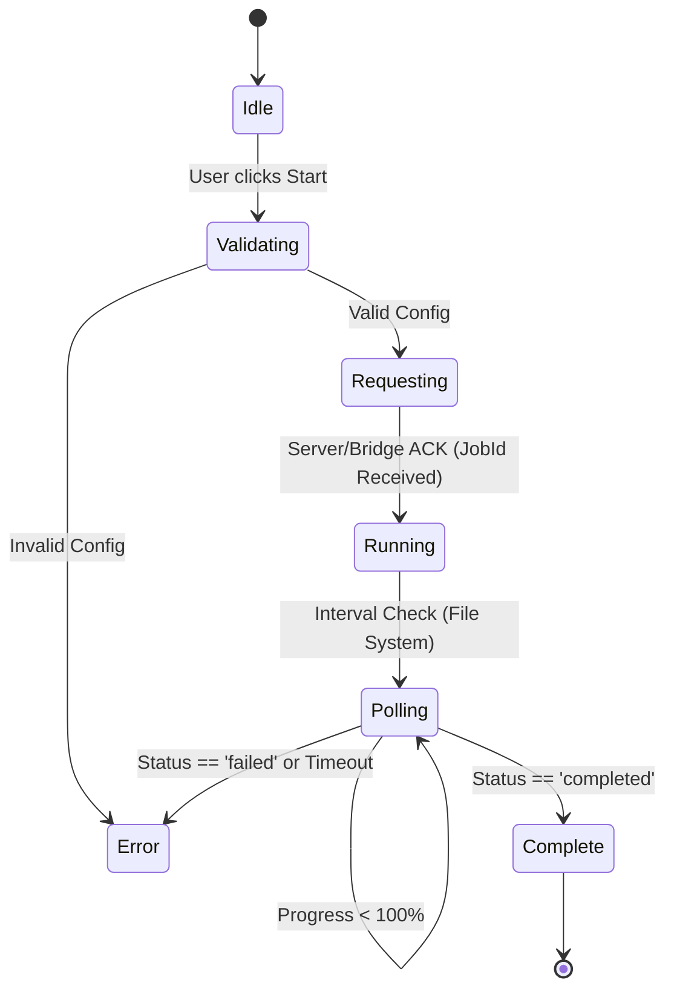

# Dashboard Technical Specification

본 문서는 인플루언서 검색 및 시뮬레이션 대시보드의 프론트엔드 기술 명세서이다. 이 시스템은 사용자의 자연어 입력을 받아 Agent 시뮬레이션을 트리거하고, 그 결과를 시각화하여 의사결정을 지원하는 **Interactive Analytics Interface**이다.

## 1. UX/UI Design Philosophy

### 1.1 "Command Center" Metaphor
단순한 관리자 페이지가 아닌, 실시간으로 상황을 통제하고 모니터링하는 **작전 상황실(Command Center)**의 경험을 제공한다.
- **Dark Mode Default**: 데이터 집중도 향상 및 전문가 도구 느낌 전달.
- **Micro-Interactions**: 사용자의 모든 액션(Hover, Click)에 즉각적인 시각적 피드백 제공 (Motion).
- **Dense Information**: 스크롤을 최소화하고 한 화면에서 다차원 데이터를 대조할 수 있는 레이아웃.

### 1.2 Layout Structure
화면은 좌측 네비게이션과 우측 콘텐츠 영역으로 나뉘며, 콘텐츠 영역은 **Context-Aware Panel System**으로 동작한다.

```
+----------------+------------------------------------------------+
|  Sidebar Nav   |  App Header (Status & Controls)                |
|                +------------------------------------------------+
|  - Home        |                                                |
|  - Search      |  [ Active Panel Area ]                         |
|  - Reports     |                                                |
|  - Settings    |  > Search Panel (Input & Filter)               |
|                |  > Results Grid (Cards)                        |
|                |  > Simulation Config (Overlay/Side)            |
|                |  > Report View (Charts & Metrics)              |
|                |                                                |
+----------------+------------------------------------------------+
```

---

## 2. Frontend Architecture

### 2.1 Technology Stack Definition
*   **Core**: React 18 (Functional Components + Hooks)
*   **Language**: TypeScript 5.x (Strict Mode)
*   **Build System**: Vite (ESBuild based)
*   **Styling Strategy**: 
    *   **Logic**: CSS Modules / Standard CSS
    *   **Tokens**: CSS Variables (`styles.css`) for Theme Management (Colors, Spacing, Typography)
*   **Animation Engine**: `framer-motion` (Declarative Animation)

### 2.2 Component Hierarchy
애플리케이션은 **Atomic Design** 변형을 따르며, 비즈니스 로직과 UI 표현을 분리한다.

*   **Atoms (`components/animations/`)**: 버튼, 카드, 뱃지 등 애니메이션이 포함된 최소 단위. (`GlowingButton`, `SpotlightCard`)
*   **Molecules**: 검색창, 필터 그룹, 메트릭 카드.
*   **Organisms (`components/*Panel.tsx`)**: 비즈니스 로직을 포함한 주요 기능 영역. (`SearchPanel`, `SimulationPanel`)
*   **Pages (`App.tsx`)**: 상태를 조율하고 전체 레이아웃을 구성하는 컨테이너.

---

## 3. Data Flow & State Management

복잡한 외부 의존성을 줄이기 위해 Redux/Zustand 대신 **React Context + Prop Drilling**을 전략적으로 사용한다. (단, 뎁스가 깊어지면 Context로 리팩토링)

### 3.1 Global States (`App.tsx`)
| State Group | Description | Persisted? |
|-------------|-------------|------------|
| `SearchContext` | 검색어(Query), 필터(Filter), 태그(Tags) | Session (Optional) |
| `SelectionContext` | 현재 선택된 인플루언서 ID | No |
| `SimulationState` | `Idle` -> `Running` -> `Polling` -> `Complete` | No |
| `SystemStatus` | Backend Health, Crawler Status | No |

### 3.2 Simulation State Machine
시뮬레이션 프로세스는 명시적인 상태 머신으로 관리된다.



---

## 4. Integration Specifications

### 4.1 Agent Bridge Protocol (`api/simulationBridge.ts`)
브라우저 보안 제약(Sandbox)을 우회하고 로컬 프로세스와 통신하기 위한 하이브리드 프로토콜.

#### A. Command Channel (HTTP)
*   **Endpoint**: `POST http://localhost:8000/api/simulation/start`
*   **Payload**:
    ```json
    {
      "goal": "Product Awareness",
      "agent_count": 5,
      "duration": 10
    }
    ```
*   **Response**: `{ "status": "success", "jobId": "sim_12345" }`

#### B. Data Channel (File Polling)
*   **Resource**: `/simulation/{jobId}.json` (Served via Vite public dir alias or symlink)
*   **Schema**: [`shared/simulation-schema.json`](../../shared/simulation-schema.json) 참조.
*   **Strategy**:
    *   **Interval**: 2000ms (Adaptive: 완료 임박 시 단축 가능)
    *   **Timeout**: 300초 (최대 대기 시간)

---

## 5. Design Tokens & Theming

일관된 Premium Look & Feel을 위한 디자인 규칙.

### 5.1 Color Palette
*   **Backgrounds**: `Surface/Dark` (#0a0a0a), `Surface/Card` (#1a1a1a, 80% opacity)
*   **Primary**: `Brand/Mint` (#62f0d1) - 긍정, 성공, 활성 상태
*   **Secondary**: `Brand/Blue` (#4a9eff) - 정보, 링크
*   **Accent**: `Brand/Amber` (#f5c26b) - 강조, 주의
*   **Text**: `Text/Primary` (#ffffff), `Text/Muted` (#888888)

### 5.2 Typography
*   **Headings**: `Space Grotesk` (Modern, Tech feel)
*   **Body**: `Inter` (Readability focus)
*   **Code/Numbers**: `JetBrains Mono` or `Monospace` (For metrics alignment)

---

## 6. Implementation Challenges & Know-how (Planning View)
실제 구현 흐름을 기준으로, 설계 단계에서 미리 문서화해야 하는 UI/통신 포인트를 정리한다.

1.  **파일 기반 폴링 경로 고정**: 시뮬레이션 결과는 `/simulation/{id}.json` 형태로 제공된다. 계획 단계에서 Vite public 경로 또는 심볼릭 링크를 통해 접근 가능한 경로를 고정한다.
2.  **폴링 제한 규칙**: 무한 폴링을 방지하기 위해 최대 폴링 횟수와 간격을 정의한다. 설계 문서에 기본 간격과 타임아웃 기준을 포함한다.
3.  **시뮬레이션 상태 정의**: 상태 값은 `pending/running/completed/failed` 흐름을 전제로 설계한다. UI는 상태에 따라 버튼/로딩/에러 메시지 노출이 달라지므로 상태별 UI 테이블을 문서화한다.
4.  **Mock/Real 동시 설계**: 실제 시뮬레이션 전에는 UI용 모의 데이터가 필요하다. 계획 문서에 "모의 결과 생성 루틴"과 실데이터 전환 조건을 분리해 기록한다.
5.  **선택/실행 잠금 규칙**: 시뮬레이션 중에는 입력 필드가 잠겨야 한다. 설계 단계에서 "런 중 입력 잠금"과 재시도 버튼 노출 규칙을 정의한다.
